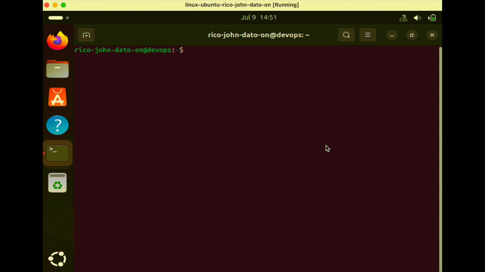

# Linux Piping and Redirection

We will explore some important Linux concepts—**piping**, **redirection**, and how commands interact through **standard input (stdin)**, **standard output (stdout)**, and **standard error (stderr)**. These concepts allow chaining and combining Linux commands in powerful ways.

---

## 🔧 Key Concepts

### Piping (`|`)

- **Definition**: Takes the output of one command and uses it as the input of another.
- **Syntax**: `command1 | command2`
- **Example**:
  ```bash
  cat /var/log/syslog | less
  ```
  

### Less Command

- Used to view long outputs page by page.
- Navigate using:
  - `Space`: Next page
  - `B`: Previous page
  - `Q`: Quit

### grep Command

- Filters lines containing specific text.
- Examples:
  ```bash
  history | grep sudo
  history | grep "sudo chmod"
  ls /usr/bin | grep python
  cat config.yaml | grep port
  ```

### Combining Piping with `less`

```bash
history | grep sudo | less
```

---

## 🔄 Redirection

### Output Redirection (`>` and `>>`)

- `>` overwrites a file with output
- `>>` appends to a file

#### Examples

```bash
history | grep sudo > sudo-commands.txt
history | grep rm >> sudo-commands.txt
```

### Save filtered command history

```bash
cat sudo-commands.txt > all-commands.txt
```

---

## 📂 Standard Streams

| Stream   | Description     |
| -------- | --------------- |
| `stdin`  | Standard Input  |
| `stdout` | Standard Output |
| `stderr` | Standard Error  |

```bash
cat nonexistingfile.txt
# This will trigger a stderr output
```

---

## 🧵 Running Commands Sequentially

Use `;` to run multiple commands on one line:

```bash
clear; sleep 1; echo "Welcome back!"
```

---

## ✅ Summary

- Chain commands using `|` (pipe).
- Filter output with `grep`.
- View large outputs with `less`.
- Save outputs with `>` or `>>`.
- Understand stdin, stdout, and stderr.
- Execute multiple commands in one line using `;`.

Mastering these tools will help you become more efficient with Linux and shell scripting! 🚀

🧑‍💻 _Created by Rico John Dato-on_  
🔗 [LinkedIn](https://www.linkedin.com/in/rico-john-dato-on) • [Portfolio](https://ricodatoon.netlify.app)
